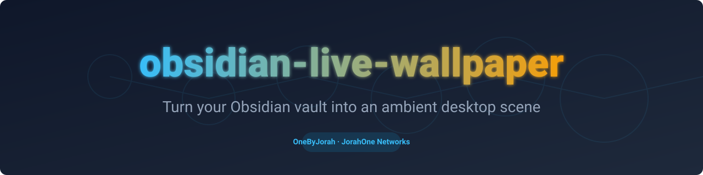
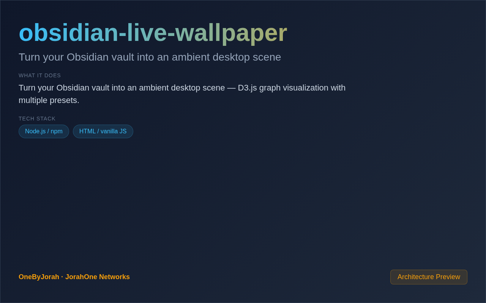

<div align="center">



# obsidian-live-wallpaper

Turn your Obsidian vault into an ambient desktop scene


</div>

---

<p align="center">
  
</p>

<br>

---

## Features

- **Knowledge Graph Visualization** — Render your Obsidian vault as a beautiful graph.
- **Ambient Desktop** — Subtle, non-distracting background visualization.
- **Live Updates** — Automatically refresh when vault changes.
- **Multiple Presets** — Various visual styles and themes.
- **Tag Clustering** — Group notes by tags for visual organization.
- **Cross-Platform** — macOS, Windows, and Linux support.
- **D3.js Powered** — Beautiful force-directed graph rendering.
- **Lightweight** — Minimal system resource usage.

## Quick Start

```bash
git clone https://github.com/OneByJorah/obsidian-live-wallpaper.git
cd obsidian-live-wallpaper

npm install
npm run setup  # Select your Obsidian vault
npm start      # Launch the wallpaper
```

### macOS Setup

1. Grant screen recording permissions
2. Select your Obsidian vault directory
3. Choose a preset theme
4. The wallpaper will appear on your desktop

### Windows Setup

1. Install the application
2. Select your Obsidian vault
3. Configure through the system tray icon

### Linux Setup

```bash
npm start

# Wayland (with swaybg or similar)
npm start -- --wayland
```

## Presets

| Preset | Description |
|--------|-------------|
| `default` | Clean minimal graph |
| `cyberpunk` | Neon-lit futuristic |
| `forest` | Nature-inspired greens |
| `ocean` | Deep blue aquatic |
| `sunset` | Warm orange/pink |
| `midnight` | Dark with subtle glow |
| `retro` | 80s pixel aesthetic |
| `minimal` | Ultra-clean monochrome |

## Configuration

| Variable | Default | Description |
|----------|---------|-------------|
| `VAULT_PATH` | — | Path to Obsidian vault |
| `PRESET` | `default` | Theme preset name |
| `POLL_INTERVAL` | `5000` | Vault refresh interval (ms) |
| `PORT` | `3210` | Web configuration port |

## Architecture

```
Obsidian Vault ──File Watcher──▶ Node.js Server ──D3.js──▶ Desktop Wallpaper
                                        │
                                        ├──▶ Graph Renderer
                                        ├──▶ Tag Cluster Engine
                                        └──▶ Preset Manager
```

## Project Structure

```
obsidian-live-wallpaper/
├── src/
│   ├── index.js           # Main entry point
│   ├── vault-scanner.js   # Obsidian vault parser
│   ├── graph-renderer.js  # D3.js graph rendering
│   └── presets/            # Theme preset configurations
├── public/
│   ├── index.html         # Configuration UI
│   └── app.js             # Frontend logic
├── presets.json            # All preset definitions
├── package.json
└── .env.example           # Configuration template
```

## How It Works

1. **Vault Scanning** — Parses your Obsidian vault's markdown files
2. **Graph Generation** — Creates a knowledge graph from wiki links and tags
3. **D3.js Rendering** — Renders the graph as a force-directed layout
4. **Desktop Overlay** — Displays the graph as your desktop wallpaper
5. **Live Updates** — Watches for vault changes and refreshes automatically

## Contributing

Contributions are welcome. Please see [CONTRIBUTING.md](CONTRIBUTING.md) for guidelines and [CODE_OF_CONDUCT.md](CODE_OF_CONDUCT.md) for community standards.

## Security

For security concerns, see [SECURITY.md](SECURITY.md). Please report vulnerabilities to **info@jorahone.com** — do not use public issues.

## License

MIT © Jhonattan L. Jimenez

---

## 🤝 Contributing

See [CONTRIBUTING.md](CONTRIBUTING.md). All contributions follow the [Code of Conduct](CODE_OF_CONDUCT.md).

## 🔒 Security

Found a vulnerability? Please follow our [Security Policy](SECURITY.md) and report privately to `security@jorahone.com`.

## 📄 License

[MIT License](LICENSE) © Jhonattan L. Jimenez (OneByJorah)

---

<p align="center">Built with 🌴 by <a href="https://github.com/OneByJorah">OneByJorah</a> · <a href="https://jorahone.com">jorahone.com</a></p>
